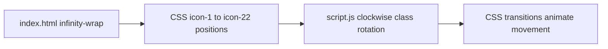
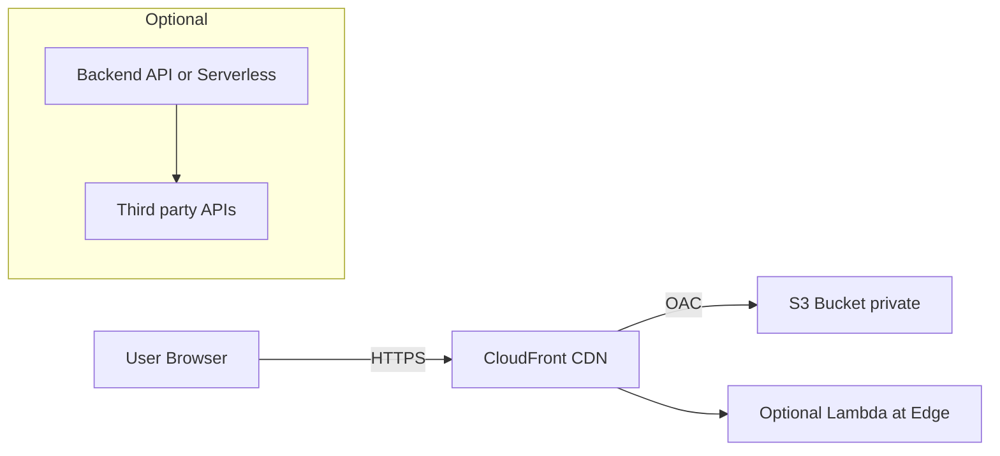
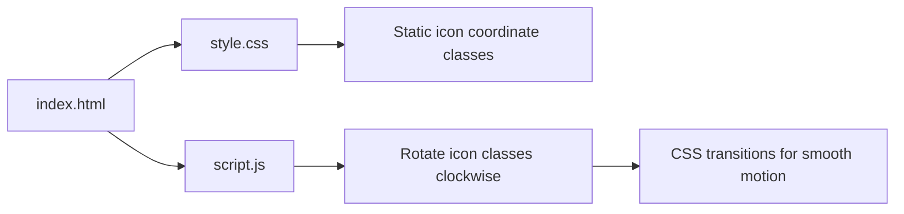

# Amol Jadhav — Portfolio (Static Site)

A clean, responsive, single-page portfolio showcasing DevOps and AI automation work. Built as a static site with pure HTML/CSS/JS and lightweight client-side libraries (GSAP, Lenis). Suitable for static hosting (S3, Netlify, GitHub Pages) and optimized for visual polish and performance.

---

## Quick Links

- Live-style demo: serve locally with a static server (instructions below)
- Deploy: AWS S3 + CloudFront instructions included

---

**Table of contents**

- Project overview
- Directory structure
- How the infinity loop works (animation details + diagrams)
- Local development
- Deployment (S3 + CloudFront) — commands and policies
- Notes on features, limitations and recommended improvements
- Contributing & License

---

## Project overview

This repo is a static portfolio site focused on visual storytelling and showcasing DevOps / AI skills.

Key features

- Hero section with an animated infinity loop of tech icons (CSS + JS, optional GSAP)
- Clockwise infinity icon motion (no traveling glow path)
- Technology dock (interactive icons + tooltips)
- Downloadable résumé and local media assets in `assets/media`
- Lightweight animations (respects `prefers-reduced-motion`)

Static-only design means the site requires no server-side runtime and is ideal for S3 or CDN hosting.

---

## Directory structure

(abridged — important files shown)

```
/ (repo root)
├─ index.html
├─ style.css
├─ script.js
├─ README.md
├─ assets/
│  ├─ icons/         # technology icons (png/svg)
│  ├─ media/         # portraits and resume (moved here)
│  │  ├─ whoIam.png
│  │  ├─ aboutme.png
│  │  └─ Amol_Jadhav_DevOps.pdf
│  └─ ...
└─ v0/ v1-infinity/  # older snapshots (archive)
```

---

## How the infinity loop works

High-level: the infinity loop is purely front-end. Icons are positioned around a decorative infinity SVG using fixed CSS coordinates. JavaScript rotates icon position classes continuously so the loop moves clockwise.

Flow (simplified):



Notes:
- Icon motion uses class-based rotation: the script rotates which `.icon-N` positioning class sits on each `` element and CSS transitions smoothly animate top/left.
- The code respects `prefers-reduced-motion` and falls back to non-animated/limited motion when browsers request reduced motion.

---

## Local development

Quick local preview (no build steps required):

Using Python 3 built-in server:

```bash
# from repo root
python3 -m http.server 8000
# then visit http://localhost:8000
```

Or using `serve` (npm):

```bash
npm install -g serve
serve -s . -l 5000
```

Make edits to `index.html`, `style.css`, or `script.js`, then refresh the browser.

---

## Deployment to AWS S3 + optional CloudFront (recommended)

This site is fully static and suitable for S3 static website hosting. For production use HTTPS and caching benefits via CloudFront.

Important considerations

- Keep the bucket content-type metadata correct (S3 sets this automatically for common extensions).
- If you want SPA routing fallback, set the error document to `index.html`.
- For secure serving and to avoid public buckets, use CloudFront with Origin Access Control (OAC) and keep the bucket private.

Example AWS CLI commands (replace BUCKET_NAME and REGION):

```bash
# create bucket (US East example)
aws s3 mb s3://BUCKET_NAME --region us-east-1

# sync local files to bucket and set files public (simple approach)
aws s3 sync . s3://BUCKET_NAME --acl public-read --exclude ".git/*" --delete

# enable static website (simple approach)
aws s3 website s3://BUCKET_NAME --index-document index.html --error-document index.html
```

Recommended production approach (private bucket + CloudFront)

1. Create S3 bucket (private)
2. Upload files with `aws s3 sync . s3://BUCKET_NAME --delete` (no public ACL)
3. Create CloudFront distribution with S3 origin and an Origin Access Control (OAC)
4. Attach ACM certificate to CloudFront and map your domain to CloudFront

Sample minimal CORS and bucket policy (use with care and adapt to your security posture):

```json
// CORS (cors.json)
[
  {
    "AllowedHeaders": ["*"],
    "AllowedMethods": ["GET"],
    "AllowedOrigins": ["*"],
    "MaxAgeSeconds": 3000
  }
]
```

```json
// Example public-read bucket policy (not recommended for private + CloudFront setups)
{
  "Version":"2012-10-17",
  "Statement":[
    {
      "Sid":"PublicReadGetObject",
      "Effect":"Allow",
      "Principal":"*",
      "Action":["s3:GetObject"],
      "Resource":["arn:aws:s3:::BUCKET_NAME/*"]
    }
  ]
}
```

For CloudFront + OAC, follow the AWS Console flow or use AWS CDK/Terraform. If you want, I can provide a CloudFront distribution JSON or an `aws cloudfront create-distribution` example.

---

## Files I changed during cleanup

- Moved personal media into `assets/media/` and updated `index.html`:
  - `whoIam.png` → `assets/media/whoIam.png`
  - `aboutme.png` → `assets/media/aboutme.png`
  - `Amol_Jadhav_DevOps.pdf` → `assets/media/Amol_Jadhav_DevOps.pdf`
- Removed several unused SVG asset files from `assets/icons/` to keep the repo tidy.
- Implemented clockwise infinity icon motion in `script.js` and tuned CSS transitions in `style.css`.
- Removed infinity traveling glow path from HTML/CSS/JS.
- Updated content copy and section headings to the latest approved wording.
- Added a local footer LinkedIn icon asset for reliable rendering: `assets/icons/linkedin.svg`.

---

## Limitations & Security

- Any integration that requires private credentials (OpenAI, Azure, backend APIs) must not be embedded in client-side JS. Use a serverless function (Lambda/API Gateway) or backend to proxy authenticated requests.
- If you add form handlers or server callbacks, GitHub Pages / S3 alone won't suffice — you'll need a small server or serverless endpoints.

---

## Diagrams

Architecture (hosting) — S3 + CloudFront



Infinity loop component flow



---

## Contributing

- Fork the repo, make a feature branch, and open a pull request.
- Keep changes small and focused; update `README.md` when altering structure or deployment steps.

