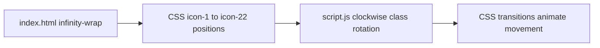
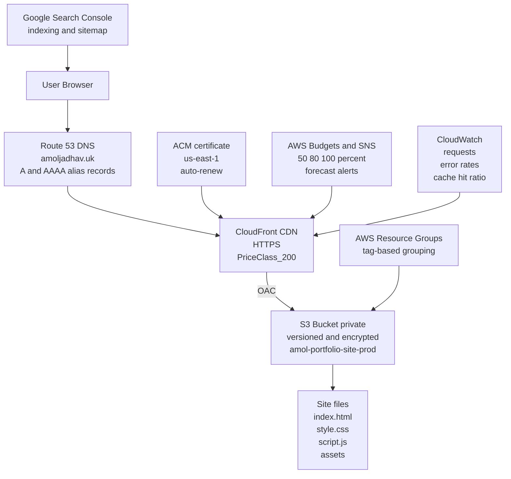
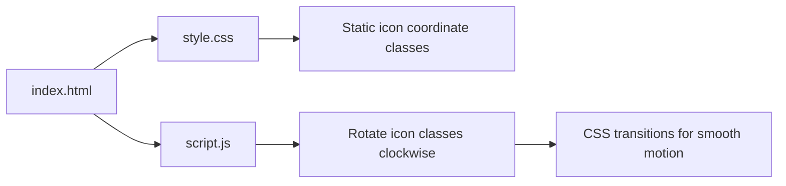

# Amol Jadhav — Portfolio (Static Site)

A clean, responsive, single-page portfolio showcasing DevOps and AI automation work. Built as a static site with pure HTML/CSS/JS and lightweight client-side libraries (GSAP, Lenis). Suitable for static hosting (S3, Netlify, GitHub Pages) and optimized for visual polish and performance.

---

## Quick Links

- Live-style demo: serve locally with a static server (instructions below)
- Deploy: AWS S3 + CloudFront instructions included

---

**Table of contents**

- Project overview
- Directory structure
- How the infinity loop works (animation details + diagrams)
- Local development
- Deployment (S3 + CloudFront) — commands and policies
- Notes on features, limitations and recommended improvements
- Contributing & License

---

## Project overview

This repo is a static portfolio site focused on visual storytelling and showcasing DevOps / AI skills.

Key features

- Hero section with an animated infinity loop of tech icons (CSS + JS, optional GSAP)
- Clockwise infinity icon motion (no traveling glow path)
- Technology dock (interactive icons + tooltips)
- Downloadable résumé and local media assets in `assets/media`
- Lightweight animations (respects `prefers-reduced-motion`)

Static-only design means the site requires no server-side runtime and is ideal for S3 or CDN hosting.

---

## Directory structure

(abridged — important files shown)

```
/ (repo root)
├─ index.html
├─ style.css
├─ script.js
├─ README.md
├─ assets/
│  ├─ icons/         # technology icons (png/svg)
│  ├─ media/         # portraits and resume (moved here)
│  │  ├─ whoIam.png
│  │  ├─ aboutme.png
│  │  └─ Amol_Jadhav_DevOps.pdf
│  └─ ...
└─ v0/ v1-infinity/  # older snapshots (archive)
```

---

## How the infinity loop works

High-level: the infinity loop is purely front-end. Icons are positioned around a decorative infinity SVG using fixed CSS coordinates. JavaScript rotates icon position classes continuously so the loop moves clockwise.

Flow (simplified):



Notes:
- Icon motion uses class-based rotation: the script rotates which `.icon-N` positioning class sits on each `` element and CSS transitions smoothly animate top/left.
- The code respects `prefers-reduced-motion` and falls back to non-animated/limited motion when browsers request reduced motion.

---

## Local development

Quick local preview (no build steps required):

Using Python 3 built-in server:

```bash
# from repo root
python3 -m http.server 8000
# then visit http://localhost:8000
```

Or using `serve` (npm):

```bash
npm install -g serve
serve -s . -l 5000
```

Make edits to `index.html`, `style.css`, or `script.js`, then refresh the browser.

---

## Deployment architecture

This site is deployed as a private S3 origin behind CloudFront, with Route 53 handling the public domain and ACM providing TLS.

Current production stack

- Domain: `amoljadhav.uk`
- DNS: Route 53 alias `A` and `AAAA` records
- CDN: CloudFront with HTTPS and `PriceClass_200`
- Origin protection: Origin Access Control (OAC)
- Origin bucket: private, versioned, encrypted S3 bucket `amol-portfolio-site-prod`
- Origin contents: `index.html`, `style.css`, `script.js`, and `assets/`
- TLS: ACM certificate in `us-east-1` with auto-renewal
- Monitoring: CloudWatch metrics for requests, error rates, and cache hit ratio
- Cost control: AWS Budgets with SNS alerts at 50%, 80%, 100%, and forecasted overspend
- Resource organization: AWS Resource Groups using tags
- Search visibility: Google Search Console for indexing and sitemap submission

Important considerations

- Keep the bucket private and let CloudFront access it through OAC only.
- Keep the bucket content-type metadata correct, especially for `.webp`, `.svg`, `.css`, and `.js` files.
- Invalidate CloudFront when `index.html` or swapped media assets change.
- If you want SPA-style fallback behavior, configure CloudFront/S3 error handling to return `index.html` where appropriate.

Example AWS CLI commands (replace distribution and bucket identifiers as needed):

```bash
# sync the site to the private origin bucket
aws s3 sync . s3://amol-portfolio-site-prod --delete --exclude ".git/*"

# invalidate changed content in CloudFront
aws cloudfront create-invalidation \
  --distribution-id YOUR_DISTRIBUTION_ID \
  --paths "/index.html" "/assets/media/*" "/style.css" "/script.js"
```

Recommended production flow

1. User requests `amoljadhav.uk`
2. Route 53 resolves the domain via alias `A` and `AAAA` records
3. CloudFront serves the site over HTTPS from edge locations in North America, Europe, Asia, Middle East, and Africa via `PriceClass_200`
4. CloudFront fetches site assets from the private S3 bucket using OAC-authenticated origin access
5. Supporting AWS services handle certificate renewal, budgets, monitoring, and resource grouping

Supporting services

- ACM: SSL/TLS certificate in `us-east-1`, auto-renewing
- AWS Budgets + SNS: cost alerts at 50%, 80%, 100%, plus forecast-based overspend notification
- CloudWatch: requests, error rates, cache hit ratio
- AWS Resource Groups: tag-based grouping for the portfolio stack
- Google Search Console: indexing and sitemap submission

---

## Files I changed during cleanup

- Moved personal media into `assets/media/` and updated `index.html`:
  - `whoIam.png` → `assets/media/whoIam.png`
  - `aboutme.png` → `assets/media/aboutme.png`
  - `Amol_Jadhav_DevOps.pdf` → `assets/media/Amol_Jadhav_DevOps.pdf`
- Removed several unused SVG asset files from `assets/icons/` to keep the repo tidy.
- Implemented clockwise infinity icon motion in `script.js` and tuned CSS transitions in `style.css`.
- Removed infinity traveling glow path from HTML/CSS/JS.
- Updated content copy and section headings to the latest approved wording.
- Added a local footer LinkedIn icon asset for reliable rendering: `assets/icons/linkedin.svg`.

---

## Limitations & Security

- Any integration that requires private credentials (OpenAI, Azure, backend APIs) must not be embedded in client-side JS. Use a serverless function (Lambda/API Gateway) or backend to proxy authenticated requests.
- If you add form handlers or server callbacks, GitHub Pages / S3 alone won't suffice — you'll need a small server or serverless endpoints.

---

## Diagrams

Architecture (hosting) — Route 53, CloudFront, private S3



Infinity loop component flow



---

## Contributing

- Fork the repo, make a feature branch, and open a pull request.
- Keep changes small and focused; update `README.md` when altering structure or deployment steps.

